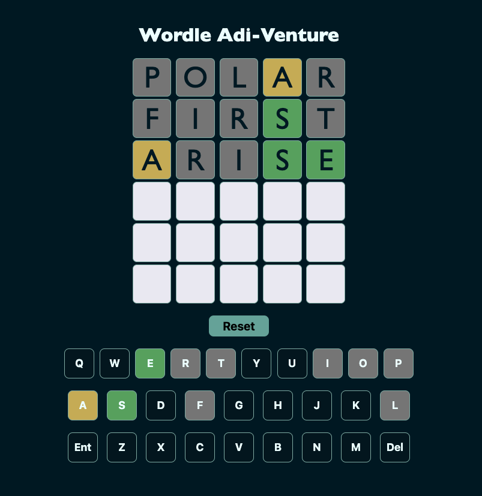

# **Wordle Adi-Venture**
**By: [Aditya Sharma](https://www.linkedin.com/in/aditya-sharma-3a0b6a190/)**

 

# **Game Link**
### Click **[Wordle Adi-Venture](https://techbyadi.github.io/wordle/)** to play 

# **Wordle Adi-Venture**

Wordle Adi-Venture is an online word puzzle game where players have six attempts to guess a five-letter word. Each guess provides feedback in the form of colored tiles indicating correct letters in the correct position, correct letters in the wrong position, and incorrect letters.

[Detailed game info here!](https://en.wikipedia.org/wiki/Wordle)

# **How to Play**

* Open the Game: [Wordle Adi-Venture](https://techbyadi.github.io/wordle/)
* First Guess: Enter a valid five-letter word.
* Submit Guess: Press "Enter" to receive feedback:
  * Letters that are in the answer and in the right place turn green.
  * Letters that are in the answer but in the wrong place turn yellow.
  * Letters that are not in the answer turn gray.
* Analyze & Guess Again: Use feedback to make new guesses.
* Repeat: Continue guessing up to six times using the feedback.
* Win or Lose: Solve the word within six attempts to win, or see the correct word after six tries.

# Motivation

I’m a big fan of quizzes and puzzles. I enjoy playing different quizzes and solving puzzles, whether online or offline. One lockdown morning, Wordle was launched, and I got hooked to it. Now, I solve (or attempt to solve) Wordle every morning.

# Technology Used 

 

# Attributions

* [Wordle](https://www.nytimes.com/games/wordle/index.html) for the creative inspiration that helped spark the development of this project!
* [Ben Manley](https://github.com/ManliestBen) for invaluable inspiration and for sharing the comprehensive data file with various difficulty levels!
* [Coolors](https://coolors.co/) for offering an excellent tool to generate vibrant color palettes!
* [Confetti](https://github.com/SEI-Remote/confetti) for providing easy-to-use confetti!
* [Icons8](https://icons8.com/icons) for providing high quality HTML, CSS, and JavaScript logos!

# Icebox functionalities

*  Add a feature: if guess includes two of one letter, they may both turn yellow, both turn green, or one could be yellow and the other green.
* Add more words in data file
* Implement responsive design

