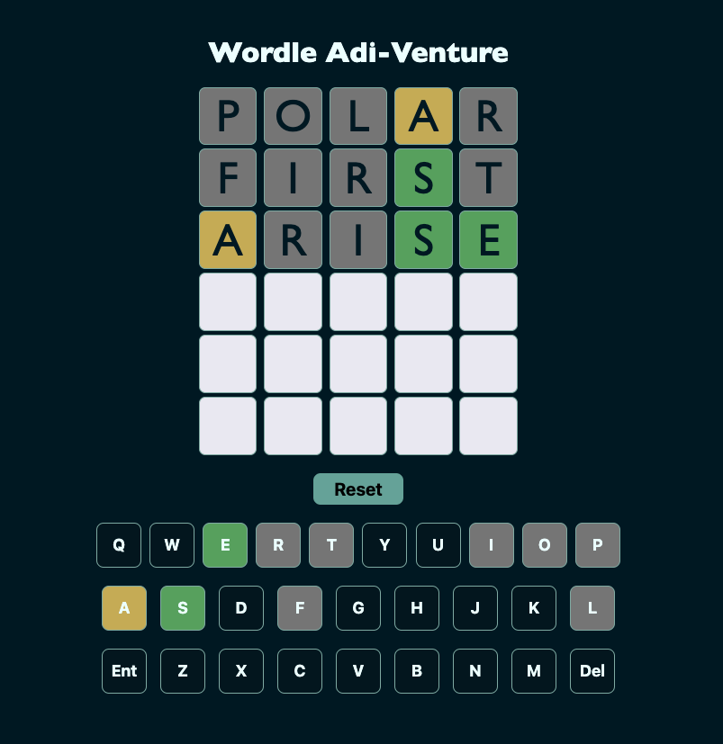

 

# **Game Link**
## Click [Wordle Adi-Venture](https://techbyadi.github.io/wordle/) here to play ##

# **Wordle Adi-Venture**

Wordle Adi-Venture is an online word puzzle game where players have six attempts to guess a five-letter word. Each guess provides feedback in the form of colored tiles indicating correct letters in the correct position, correct letters in the wrong position, and incorrect letters.

[Detailed game info here!](https://en.wikipedia.org/wiki/Wordle)

# **How to Play**

* Open the Game: [Wordle Adi-Venture](https://techbyadi.github.io/wordle/)
* First Guess: Enter a valid five-letter word.
* Submit Guess: Press "Enter" to receive feedback:
  * Green: Correct letter and position.
  * Yellow: Correct letter, wrong position.
  * Gray: Letter not in the word.
* Analyze & Guess Again: Use feedback to make new guesses.
* Repeat: Continue guessing up to six times using the feedback.
* Win or Lose: Solve the word within six attempts to win, or see the correct word after six tries.

# Motivation

Add here...

# Technology Used 

 

# Attributions

*
*
* 

# Icebox functionalities

* 
*
*

